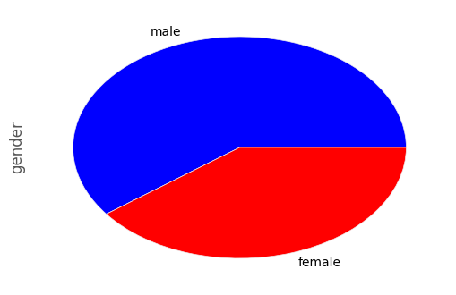
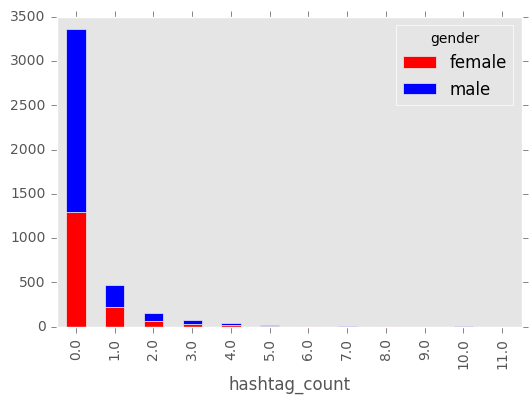

# Part 1 -  Collecting Data (Tweets from NY)

## Data - PreProcessing

Because we don't have property of gender in tweet structure, we needed to use the NLTK well known names to build our train dataset.

In order to extract as much as possible the correct gender, we filter all the names which can be use for female and for male.


```python
#import nltk
#nltk.download()

from nltk.corpus import names

def GetWellDefineGenderFromName(first_name):
    first_name = first_name.lower()
    first_name = first_name.title()
    matchMale = False
    matchFemale = False
    if first_name in names.words("male.txt"):
        matchMale = True
    if first_name in names.words("female.txt"):
        matchFemale = True
    if matchMale and matchFemale:
        return None
        
    if matchMale:        
        return 'male'
        
    if matchFemale:
        return 'female'        
        
    return None
```

## Fetch raw data from tweeter

We choose that our population will be people from NY.

In order to get a meaningful tweets (means no commercial tweets from real people),we did the following:

1. Search for the words 'The', 'I', 'she', 'and'.
2. Ensure that the user language is english.
3. Ensure that the user location is NY.
4. Ensure that the name gender is well define as explaind above. 


```python
#!conda install -c conda-forge tweepy=3.5.0
#!conda install -c malev gender_detector=0.1.0

import tweepy
from tweepy import Stream
from tweepy.streaming import StreamListener
import requests
import json

auth = tweepy.OAuthHandler(consumer_key, consumer_secret)
auth.set_access_token(access_token, access_token_secret)

api = tweepy.API(auth)

class StdOutListener(StreamListener):
    def on_data(self, data):            
        
        tweet = json.loads(data)
        
        if not tweet.get('user'):
            return True
        
        user = tweet['user']    
        
        if user['lang'] != 'en':
            return True
        
        if user['location'] is None:
            return True
        
        if 'New York' not in user['location'] and 'NY' not in user['location']:
            return True
        
        gender = GetWellDefineGenderFromName(user['name'].encode('utf-8').split()[0])
        
        if gender is None:
            return True
        
        # append the hourly tweet file
        with open('tweets.data', 'a+') as f:
            f.write(data)            
        
        return True
    
    def on_error(self, status):
        print('status: %s' % status)

streamListener = StdOutListener()
stream = Stream(auth, streamListener, timeout=30)


####
#call the below function when you want to fetch data
####

stream.filter(locations=[-74,40,-73,41], track=['The', 'I', 'she', 'and'])
```

## Data Cleaning - Define fucntions

### Decoding text to Ascii

Most of the NL Algorithms works with ASCII.


```python
def UTFToAscii(string):
    return string.decode('ascii', 'ignore')
```

### Extract URLs, @user_reference, hashtags Count


```python
def ExtractReference(string):
    reference_count = 0
    hashtag_count = 0
    urls_count = 0
    for i in string.split():
        s, n, p, pa, q, f = urlparse.urlparse(i)
        if s and n:
            urls_count = urls_count + 1
        elif i[:1] == '@':
            reference_count = reference_count + 1
        elif i[:1] == '#':
            hashtag_count = hashtag_count + 1            
        else:
            pass
    return reference_count, hashtag_count, urls_count
```

### Remove URLs, hashtags, @user_reference


```python
import re
import urlparse

def RemoveNonWords(string):
    return re.sub("(@[A-Za-z0-9]+)|([^0-9A-Za-z \t])|(\w+:\/\/\S+)", "", string)
```

### Handle Escaping Characters


```python
import HTMLParser

def RemoveEscaping(string):
    html_parser = HTMLParser.HTMLParser()
    return html_parser.unescape(string)
```

### Convert to lowercase


```python
def ToLowercase(string):
    return string.lower()
```

### Handle Apostrophe Lookup


```python
import csv

def ReplaceApostrophe(string):
    appostophes_dict = None

    with open('appostophes.csv', mode='r') as infile:
        reader = csv.reader(infile)
        appostophes_dict = {rows[0]:rows[1] for rows in reader}
    
    words = string.split()
    reformed = [appostophes_dict[word] if word in appostophes_dict else word for word in words]
    string = " ".join(reformed)
    return string
    
```

### Clean RT


```python
def RemoveRT(string):
    words = string.split()
    reformed = ['' if word in 'RT' else word for word in words]
    string = " ".join(reformed)
    return string
```

### Flat Lines


```python
def FlatLines(string):
    lines = string.splitlines()
    string = " ".join(lines)
    return string
```

## Create dataframe from Json tweets file


```python
import pandas as pd
import json

def IsEnglish(s):
    for i in s.split():
        if not i.isalpha():
            return False
    return True    

#read data from tweets.data

tweets_df = pd.DataFrame(columns=['id', 'text', 'reference_count', 'hashtag_count', 'urls_count' ,'name', 'gender'])
for line in open('tweets.data', 'r'):    
    tweet_data = json.loads(line)
    tweet_fullname = tweet_data['user']['name'].encode('utf-8')
    if IsEnglish(tweet_fullname) == False:
        continue

    if len(tweet_fullname.split()) < 2:
        continue

    tweet_text = tweet_data['text'].encode('utf-8')
    tweet_text = UTFToAscii(tweet_text)
    tweet_text = RemoveEscaping(tweet_text)
    tweet_text = FlatLines(tweet_text)
    reference_count, hashtag_count, urls_count = ExtractReference(tweet_text)
    tweet_text = RemoveNonWords(tweet_text)    
    tweet_text = RemoveRT(tweet_text)
    tweet_text = ToLowercase(tweet_text)
    tweet_text = ReplaceApostrophe(tweet_text)

    #filter all text that smaller then 2 words
    if len(tweet_text.split()) < 3:
        continue
    
    #filter all names with no legal capital letter
    if  len(re.findall(r'[A-Z]',tweet_fullname)) != len(tweet_fullname.split()):            
        continue
    
    gender = GetWellDefineGenderFromName(tweet_fullname.split()[0])
    
    if gender is None:
        continue

    tweets_df.loc[len(tweets_df)]=[tweet_data['id_str'], tweet_text, reference_count, hashtag_count, urls_count, tweet_fullname, gender]

```

## Data Exploration

First quick look in the data:


```python
tweets_df.head(10)
```


<div>
<table border="1" class="dataframe">
  <thead>
    <tr style="text-align: right;">
      <th></th>
      <th>id</th>
      <th>text</th>
      <th>reference_count</th>
      <th>hashtag_count</th>
      <th>urls_count</th>
      <th>name</th>
      <th>gender</th>
    </tr>
  </thead>
  <tbody>
    <tr>
      <th>0</th>
      <td>875088051977977856</td>
      <td>how to give your employees the recognition the...</td>
      <td>0.0</td>
      <td>1.0</td>
      <td>1.0</td>
      <td>Guy Santeramo</td>
      <td>male</td>
    </tr>
    <tr>
      <th>1</th>
      <td>875088067471831043</td>
      <td>that was lovely thank you for sharing i too lo...</td>
      <td>3.0</td>
      <td>0.0</td>
      <td>1.0</td>
      <td>Alexa Harrison</td>
      <td>female</td>
    </tr>
    <tr>
      <th>2</th>
      <td>875088072786022400</td>
      <td>sling could a team made entirely of players wh...</td>
      <td>0.0</td>
      <td>0.0</td>
      <td>1.0</td>
      <td>Jay Zampi</td>
      <td>male</td>
    </tr>
    <tr>
      <th>3</th>
      <td>875088110736089089</td>
      <td>my fan theory is that your fan theory has noth...</td>
      <td>1.0</td>
      <td>0.0</td>
      <td>0.0</td>
      <td>Susana Polo</td>
      <td>female</td>
    </tr>
    <tr>
      <th>4</th>
      <td>875088135889334273</td>
      <td>if you say so princess im sure hell love to se...</td>
      <td>1.0</td>
      <td>0.0</td>
      <td>1.0</td>
      <td>Brad Gibson</td>
      <td>male</td>
    </tr>
    <tr>
      <th>5</th>
      <td>875088148770033665</td>
      <td>when she asks you what you bring to the table</td>
      <td>1.0</td>
      <td>0.0</td>
      <td>1.0</td>
      <td>Solomon Grundy</td>
      <td>male</td>
    </tr>
    <tr>
      <th>6</th>
      <td>875088173939818497</td>
      <td>finally biting the bullet and reserving hotel ...</td>
      <td>0.0</td>
      <td>1.0</td>
      <td>0.0</td>
      <td>Meg Roy</td>
      <td>female</td>
    </tr>
    <tr>
      <th>7</th>
      <td>875088203258109952</td>
      <td>im speaking at digipub summit in new york this...</td>
      <td>0.0</td>
      <td>2.0</td>
      <td>1.0</td>
      <td>Adam Smith</td>
      <td>male</td>
    </tr>
    <tr>
      <th>8</th>
      <td>875088215715217410</td>
      <td>this couldnt be easier i just called my rep to...</td>
      <td>1.0</td>
      <td>0.0</td>
      <td>0.0</td>
      <td>Krystyna Hutchinson</td>
      <td>female</td>
    </tr>
    <tr>
      <th>9</th>
      <td>875088231964041218</td>
      <td>the gun contagion in america continues to thre...</td>
      <td>1.0</td>
      <td>0.0</td>
      <td>1.0</td>
      <td>Michael Corley</td>
      <td>male</td>
    </tr>
  </tbody>
</table>
</div>


The texts are look good and also the names the and the gender.


```python
tweets_df.describe(include='all')
```


<div>
<table border="1" class="dataframe">
  <thead>
    <tr style="text-align: right;">
      <th></th>
      <th>id</th>
      <th>text</th>
      <th>reference_count</th>
      <th>hashtag_count</th>
      <th>urls_count</th>
      <th>name</th>
      <th>gender</th>
    </tr>
  </thead>
  <tbody>
    <tr>
      <th>count</th>
      <td>4133</td>
      <td>4133</td>
      <td>4133.000000</td>
      <td>4133.000000</td>
      <td>4133.000000</td>
      <td>4133</td>
      <td>4133</td>
    </tr>
    <tr>
      <th>unique</th>
      <td>4133</td>
      <td>3986</td>
      <td>NaN</td>
      <td>NaN</td>
      <td>NaN</td>
      <td>3361</td>
      <td>2</td>
    </tr>
    <tr>
      <th>top</th>
      <td>875432697602113537</td>
      <td>i just want a country where affording health c...</td>
      <td>NaN</td>
      <td>NaN</td>
      <td>NaN</td>
      <td>Joe Dicandia</td>
      <td>male</td>
    </tr>
    <tr>
      <th>freq</th>
      <td>1</td>
      <td>8</td>
      <td>NaN</td>
      <td>NaN</td>
      <td>NaN</td>
      <td>14</td>
      <td>2490</td>
    </tr>
    <tr>
      <th>mean</th>
      <td>NaN</td>
      <td>NaN</td>
      <td>1.032664</td>
      <td>0.345996</td>
      <td>0.533995</td>
      <td>NaN</td>
      <td>NaN</td>
    </tr>
    <tr>
      <th>std</th>
      <td>NaN</td>
      <td>NaN</td>
      <td>0.987407</td>
      <td>0.966179</td>
      <td>0.571270</td>
      <td>NaN</td>
      <td>NaN</td>
    </tr>
    <tr>
      <th>min</th>
      <td>NaN</td>
      <td>NaN</td>
      <td>0.000000</td>
      <td>0.000000</td>
      <td>0.000000</td>
      <td>NaN</td>
      <td>NaN</td>
    </tr>
    <tr>
      <th>25%</th>
      <td>NaN</td>
      <td>NaN</td>
      <td>0.000000</td>
      <td>0.000000</td>
      <td>0.000000</td>
      <td>NaN</td>
      <td>NaN</td>
    </tr>
    <tr>
      <th>50%</th>
      <td>NaN</td>
      <td>NaN</td>
      <td>1.000000</td>
      <td>0.000000</td>
      <td>0.000000</td>
      <td>NaN</td>
      <td>NaN</td>
    </tr>
    <tr>
      <th>75%</th>
      <td>NaN</td>
      <td>NaN</td>
      <td>1.000000</td>
      <td>0.000000</td>
      <td>1.000000</td>
      <td>NaN</td>
      <td>NaN</td>
    </tr>
    <tr>
      <th>max</th>
      <td>NaN</td>
      <td>NaN</td>
      <td>9.000000</td>
      <td>11.000000</td>
      <td>3.000000</td>
      <td>NaN</td>
      <td>NaN</td>
    </tr>
  </tbody>
</table>
</div>


```python
tweets_df['gender'] = tweets_df['gender'].astype('category')
tweets_df.gender.value_counts()
```


    male      2490
    female    1643
    Name: gender, dtype: int64


We have 4133 samples.

female: ~0.39
male:~0.61

Types:


```python
tweets_df.dtypes
```


    id                   object
    text                 object
    reference_count     float64
    hashtag_count       float64
    urls_count          float64
    name                 object
    gender             category
    dtype: object


Should not be missing values:


```python
tweets_df.isnull().sum()
```


    id                 0
    text               0
    reference_count    0
    hashtag_count      0
    urls_count         0
    name               0
    gender             0
    dtype: int64


### Male ,Female Ratio


```python
import matplotlib.pyplot as plt
import matplotlib
matplotlib.style.use('ggplot')

%matplotlib inline

plt.figure();

tweets_df.gender.value_counts().plot(kind='pie', colors=['blue','red'])
```


    <matplotlib.axes._subplots.AxesSubplot at 0x86068278>





## Tweet Reference, Hashtag, URL Count By Gender


Let's explore the information which we extract from the original tweet text.


```python
var = pd.crosstab(tweets_df['reference_count'], tweets_df['gender'])
var.plot(kind='bar', stacked=True, color=['red','blue'], grid=False)
```


    <matplotlib.axes._subplots.AxesSubplot at 0xc6402358>


```python
var = pd.crosstab(tweets_df['hashtag_count'], tweets_df['gender'])
var.plot(kind='bar', stacked=True, color=['red','blue'], grid=False)
```


    <matplotlib.axes._subplots.AxesSubplot at 0xa8b05198>





```python
var = pd.crosstab(tweets_df['urls_count'], tweets_df['gender'])
var.plot(kind='bar', stacked=True, color=['red','blue'], grid=False)
```


    <matplotlib.axes._subplots.AxesSubplot at 0xb31773c8>


We can see from above that this features not give us in additional information. (the male/female ratio remains almost the same for each value).


```python

```
